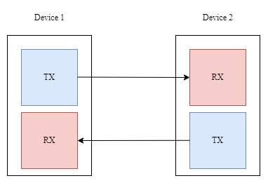

This repository hosts a comprehensive implementation of RS232 communication protocol utilizing VHDL targeting FPGA boards. RS232, 
a widely-used standard for serial communication, is employed here to facilitate robust data transfer between systems. The data 
transmission format adheres to the RS232 standard, where each data packet consists of 8 bits and the communication speed is set
to 9600 bits per second (bps), ensuring efficient data exchange within the specified bandwidth. In implementation, start, stop 
and parity bits have been taken into account as well. 

Many embedded systems rely on RS232 for serial communication, enabling interaction with external devices, debugging, and 
firmware updates.

